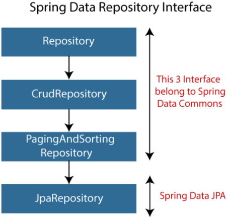

# SpringBoot: repositorios Spring Data



*Fuente: https://medium.com/@pramudaliyanage/query-methods-in-spring-data-jpa-cc043ec07a38*

## CrudRepository

CrudRepository es una interfaz proporcionada por Spring Data que proporciona métodos genéricos para operaciones CRUD (Create, Read, Update, Delete) en una entidad de dominio.

Al extender CrudRepository, el desarrollador obtiene varios métodos listos para usar sin necesidad de implementarlos manualmente. Algunos de estos métodos son:

- **save(S entity):** Guarda la entidad dada. Si la entidad ya existe, la actualiza.
- **findById(ID id):** Retorna una entidad por su ID.
- **existsById(ID id):** Verifica si una entidad existe por su ID.
- **findAll():** Retorna todas las entidades.
- **deleteById(ID id):** Borra la entidad por su ID.
- **deleteAll():** Borra todas las entidades.

Por ejemplo, si se tiene una entidad User, se puede crear un repositorio UserRepository de la siguiente manera:

```
import org.springframework.data.repository.CrudRepository;

public interface UserRepository extends CrudRepository<User, Long> {

}
```
Una vez que se ha creado este repositorio, se puede inyectar en cualquier clase y usarlo para realizar operaciones CRUD en la entidad User.

## JpaRespository

JpaRepository es otra interfaz proporcionada por Spring Data que extiende CrudRepository y PagingAndSortingRepository (que proporciona métodos para paginar y ordenar registros). Por lo tanto, JpaRepository hereda todos los métodos de estas dos interfaces.

JpaRepository también proporciona algunas funcionalidades adicionales específicas de JPA, como:

- **flush():** Aplica todas las operaciones pendientes a la base de datos.
- **deleteAllInBatch(Iterable<T> entities):** Borra las entidades en un lote, lo que es más eficiente que borrar una por una.
- <S extends T> List<S> findAll(Example<S> example): Soporte para consultas de ejemplo con la API Query By Example.

Aquí hay un ejemplo de cómo se puede crear un repositorio UserRepository que extiende JpaRepository:

```
import org.springframework.data.jpa.repository.JpaRepository;

public interface UserRepository extends JpaRepository<User, Long> {

}
```

De igual manera que con CrudRepository, una vez que se ha creado este repositorio, se puede inyectar en cualquier clase y usarlo para realizar operaciones CRUD, además de las operaciones adicionales proporcionadas por JpaRepository, en la entidad User.

Es importante mencionar que, si bien JpaRepository proporciona más funcionalidad que CrudRepository, no todas las aplicaciones necesitarán esta funcionalidad adicional. Por lo tanto, el desarrollador debe considerar cuidadosamente qué interfaz es la más adecuada para sus necesidades específicas.

## Operaciones derivadas del nombre del método

Spring Data JPA tiene una característica poderosa que permite crear consultas simplemente definiendo una interfaz de método en el repositorio. Este enfoque es mejor conocido como **"operaciones derivadas del nombre del método"**.

En este sistema, el nombre de los métodos de la interfaz del repositorio sigue una convención que Spring Data interpreta y traduce en la consulta SQL correspondiente. 

Por ejemplo, si tu entidad tiene un campo llamado email y quieres buscar una entidad basándote en ese campo, puedes añadir el método findByEmail(String email) a tu repositorio. No necesitas proporcionar ninguna implementación para este método. En tiempo de ejecución, Spring Data generará una implementación adecuada.

Aquí hay un ejemplo con una entidad User y un repositorio UserRepository:

```
import org.springframework.data.repository.CrudRepository;
import java.util.List;

public interface UserRepository extends CrudRepository<User, Long> {
    List<User> findByEmail(String email);
}
```

Cuando este código se ejecuta, Spring Data JPA creará una implementación del método findByEmail que ejecuta una consulta SQL similar a SELECT * FROM user WHERE email = ?.

La convención de nomenclatura soporta varias palabras clave que pueden ayudar a construir consultas más complejas, como And, Or, Between, LessThan, GreaterThan, Like, OrderBy, y muchas más. Por ejemplo:

```
import org.springframework.data.repository.CrudRepository;
import java.util.List;

public interface UserRepository extends CrudRepository<User, Long> {
    List<User> findByEmailAndFirstName(String email, String firstName);
    List<User> findByAgeBetween(int startAge, int endAge);
    List<User> findByLastNameLike(String lastName);
    List<User> findByAgeGreaterThan(int age);
    List<User> findByFirstNameOrderByLastNameAsc(String firstName);
}
```

Estos métodos se traducirán en las siguientes consultas SQL:

- SELECT * FROM user WHERE email = ? AND firstName = ?
- SELECT * FROM user WHERE age BETWEEN ? AND ?
- SELECT * FROM user WHERE lastName LIKE ?
- SELECT * FROM user WHERE age > ?
- SELECT * FROM user WHERE firstName = ? ORDER BY lastName ASC

Es importante recordar que, aunque las operaciones derivadas del nombre del método pueden simplificar la implementación de las operaciones de consulta comunes, también pueden llevar a nombres de métodos largos y difíciles de leer para consultas más complejas. En tales casos, puede ser preferible utilizar la **anotación @Query** para definir la consulta directamente.

## Consultas personalizadas

Si bien las operaciones derivadas del nombre del método son poderosas y cubren una gran cantidad de casos de uso comunes, hay momentos en que se necesita un mayor control sobre la consulta de la base de datos. Para estos casos, Spring Data JPA proporciona una forma de especificar consultas personalizadas a través de la anotación @Query.

La anotación @Query se puede utilizar para especificar una consulta JPQL (Java Persistence Query Language) que será ejecutada. La consulta puede hacer referencia a los parámetros del método utilizando un índice basado en 1 precedido por un signo de interrogación.

Por ejemplo, si se quiere buscar usuarios por su apellido, pero solo se quiere retornar aquellos usuarios que tengan un correo electrónico que termine con un cierto dominio, se podría utilizar la anotación @Query para definir esta consulta personalizada en la interfaz del repositorio:

```
import org.springframework.data.jpa.repository.JpaRepository;
import org.springframework.data.jpa.repository.Query;
import java.util.List;

public interface UserRepository extends JpaRepository<User, Long> {
    @Query("SELECT u FROM User u WHERE u.lastName = ?1 AND u.email LIKE %?2")
    List<User> findByLastNameAndEmailDomain(String lastName, String emailDomain);
}

```

En este caso, ?1 se refiere al primer parámetro del método (lastName) y %?2 se refiere al segundo parámetro (emailDomain), con un símbolo de porcentaje (%) añadido para la operación LIKE.

La anotación @Query también puede ser utilizada para ejecutar consultas nativas SQL, simplemente pasando el atributo nativeQuery = true a la anotación. Por ejemplo:

```
import org.springframework.data.jpa.repository.JpaRepository;
import org.springframework.data.jpa.repository.Query;
import java.util.List;

public interface UserRepository extends JpaRepository<User, Long> {
    @Query(value = "SELECT * FROM Users u WHERE u.last_name = ?1 AND u.email LIKE %?2", nativeQuery = true)
    List<User> findByLastNameAndEmailDomain(String lastName, String emailDomain);
}
```

Aquí se está ejecutando una consulta SQL nativa en lugar de una consulta JPQL. Por favor, ten en cuenta que las consultas nativas son específicas de la base de datos y no son portables entre diferentes tipos de bases de datos.

Las consultas personalizadas proporcionan un gran nivel de control sobre las operaciones de la base de datos y permiten al desarrollador escribir consultas complejas que no pueden ser fácilmente expresadas a través de las operaciones derivadas del nombre del método.


*Fuente: https://certidevs.com/tutorial-spring-boot-repositorios-crud*