# Conceptos Claves de Seguridad en Aplicaciones Web

## Autenticación vs. Autorización

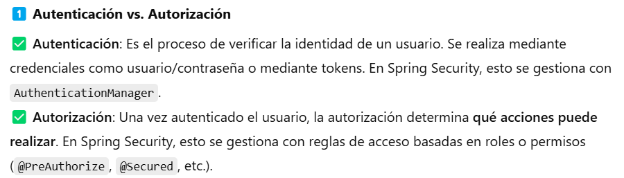


## JWT (JSON Web Token)

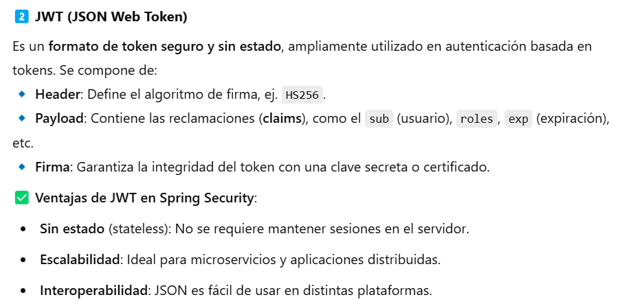

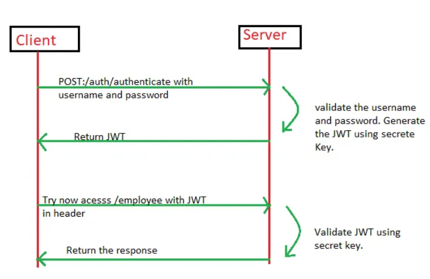

___

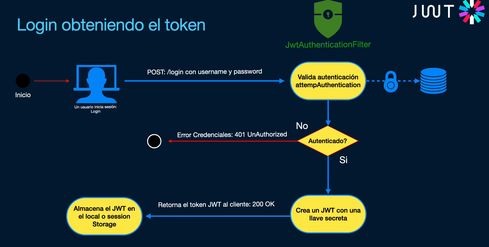

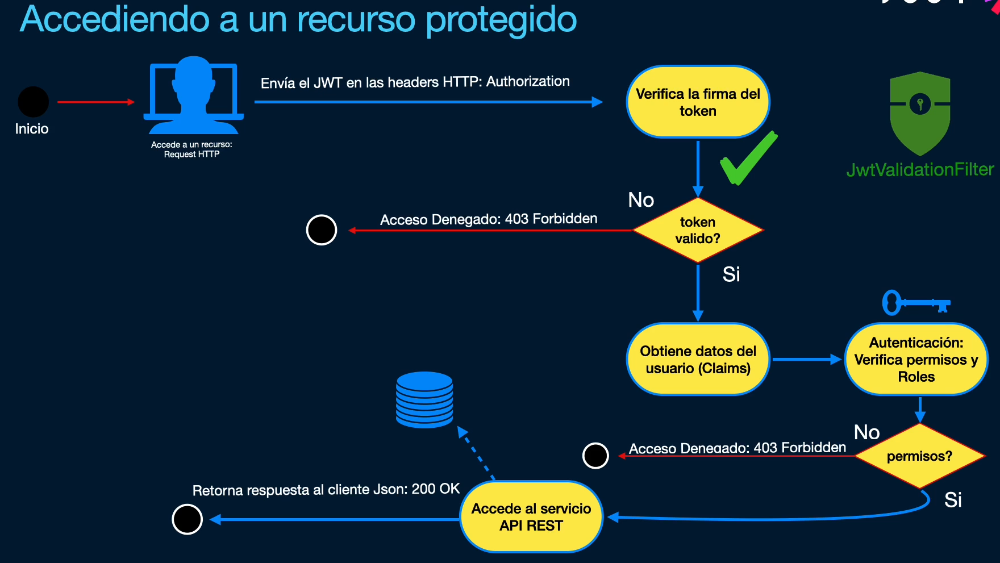

*Fuente: Udemy - Construye aplicaciones web Spring Framework 6 y Spring Boot 3*

___

https://jwt.io/

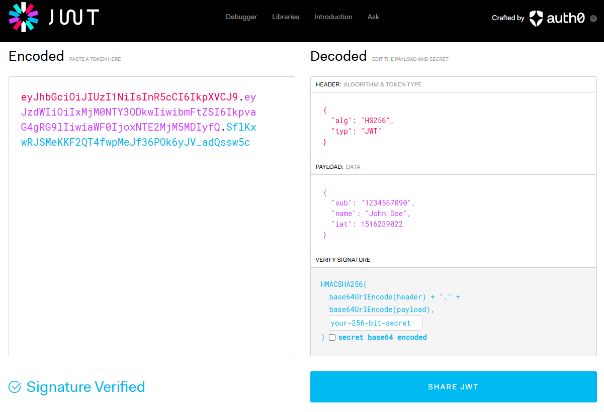


Cuando un usuario haga login (inicie sesión), en vez de trabajar con sesiones, como se hace tradicionalmente, que consume recursos de backend (se genera una cookie, se consume memoria porque ocupa recursos), se genera un token con cierta información (payload).

El token tendrá información no sensible:

- Fecha de generación.
- Fecha de expedición.
- Nombre.
- Email.
- No tendrá la password...

Esta información se firma con un algoritmo, con una clave privada que solo conoce la apliación de Spring Boot.

Cuando a la aplicación le llega el token, la aplicación intenta decodificarlo con esa clave:

- Si se puede decodificar, el token lo ha creado la apliación y se da acceso.
- Si no se puede decodificar, no confiamos en él y no se da acceso.

## Spring Security

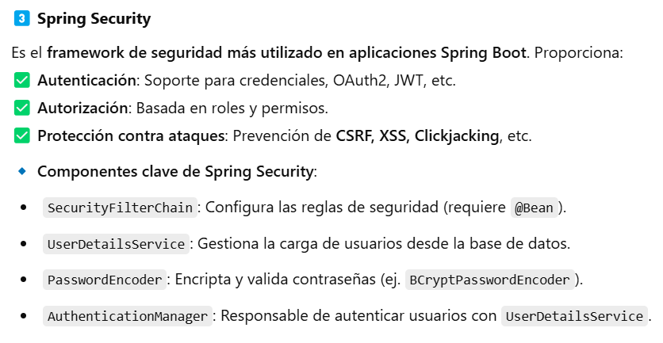

# Ejemplo Práctico: Implementación de Spring Security con JWT

## Crea el proyecto y agregar dependencias

El proyecto Spring Boot debe llamarse **SpringSecurity**.

El "Group" y "Package Name" serán **es.daw.springsecurity**

Buscamos *Security* en Starters del pom.xml:

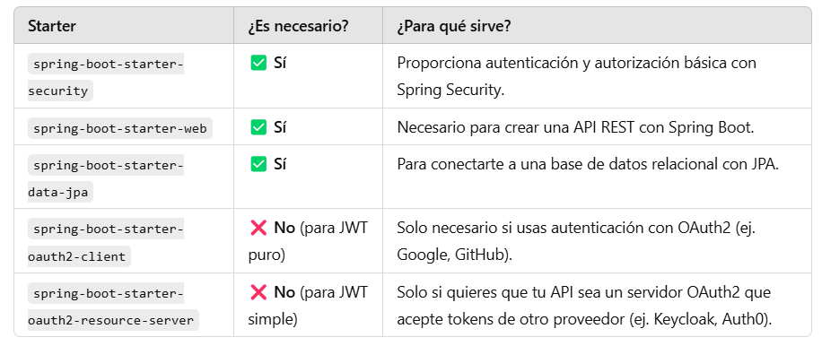

## Configurar H2 en memoria

```
# Configuración de H2 en memoria
spring.datasource.url=jdbc:h2:mem:testdb
spring.datasource.driverClassName=org.h2.Driver
spring.datasource.username=sa
spring.datasource.password=
spring.jpa.database-platform=org.hibernate.dialect.H2Dialect

# Habilitar consola H2 (acceder en: http://localhost:8080/h2-console)
spring.h2.console.enabled=true
spring.h2.console.path=/h2-console

# Hacer que Hibernate recree la base de datos en cada reinicio
spring.jpa.hibernate.ddl-auto=create-drop
```

- Con **create-drop** se crea todas las tablas automáticamente y se eliminan cuando la aplicación se detiene.
- Con **update** se conservan las tablas entre ejecuciones. Si en el futuro quieres que los datos persistan entre reinicios, lo adecuado es cambiar la base de datos a file, no mem y configurar update.

## Cargar datos por defecto

Crear un archivo SQL en **src/main/resources/import.sql**

Spring Boot ejecutará automáticamente los scripts SQL ubicados en src/main/resources cuando se arranque la aplicación. 


**Contenido de import.sql:**

```
-- Crear roles por defecto
INSERT INTO roles (name) VALUES ('ROLE_USER');
INSERT INTO roles (name) VALUES ('ROLE_ADMIN');

-- No vamos a crear usuarios. Se crearán a través de un endpoint

```

## Crear Entidades de Usuario y Rol

Entidad Role:

```
@Entity
@Table(name = "roles")
@Data
@NoArgsConstructor
@AllArgsConstructor
public class Role {
    @Id
    @GeneratedValue(strategy = GenerationType.IDENTITY)
    private Long id;

    @Column(unique = true, nullable = false)
    private String name;

    // Relación inversa con 'User'
    @ManyToMany(mappedBy = "roles")  // 'roles' es el nombre del atributo en la entidad User
    private Set<User> users;    
}

```

Entidad User:

```
@Entity
@Table(name = "users")
@Data
@NoArgsConstructor
@AllArgsConstructor
@Builder
public class User implements UserDetails {
    @Id
    @GeneratedValue(strategy = GenerationType.IDENTITY)
    private Long id;

    @Column(unique = true, nullable = false)
    private String username;

    @Column(nullable = false)
    private String password;

    @ManyToMany(fetch = FetchType.EAGER)
    @JoinTable(
        name = "user_roles",
        joinColumns = @JoinColumn(name = "user_id"),
        inverseJoinColumns = @JoinColumn(name = "role_id")
    )
    private Set<Role> roles;

    @Override
    public Collection<? extends GrantedAuthority> getAuthorities() {
        return roles.stream()
                .map(role -> (GrantedAuthority) role::getName)
                .collect(Collectors.toSet());
    }

    @Override
    public boolean isAccountNonExpired() { return true; }

    @Override
    public boolean isAccountNonLocked() { return true; }

    @Override
    public boolean isCredentialsNonExpired() { return true; }

    @Override
    public boolean isEnabled() { return true; }
}

```

Spring Security trabaja con un sistema de autenticación basado en **UserDetailsService**, que carga los usuarios desde la base de datos. Al **implementar UserDetails**, tu entidad User es compatible con Spring Security y puedes personalizar la lógica de autenticación y autorización.

Por otro lado, la anotación **@Builder** permite crear objetos con el patrón Builder:

```
User user = User.builder()
    .username("admin")
    .password("password")
    .roles(Set.of(new Role(1L, "ROLE_USER")))
    .build();

```

Sin usar @Builder:

```
User user = new User();
user.setUsername("admin");
user.setPassword("password");
user.setRoles(Set.of(new Role(1L, "ROLE_USER")));

```

En nuestro caso, Lombok genere automáticamente:

```
public static UserBuilder builder() {
    return new UserBuilder();
}

```

**Cuidado!!!** No es recomendable declarar User como un @Bean en el contexto de Spring. Las entidades (@Entity) deben ser gestionadas por JPA y no por el contenedor de Spring.

## Crear Repositorios

Repositorio de usuarios:

```
public interface UserRepository extends JpaRepository<User, Long> {
    Optional<User> findByUsername(String username);
}

public interface RoleRepository extends JpaRepository<Role, Long> {
    Optional<Role> findByName(String name);
}

```

## Implementar el Servicio de Usuarios

Ahora usaremos el repositorio para cargar usuarios desde la base de datos.

```
@Slf4j
@Service
public class UserService implements UserDetailsService {
    private final UserRepository userRepository;

    @Autowired
    public UserService(UserRepository userRepository) {
        this.userRepository = userRepository;
    }

    @Override
    public UserDetails loadUserByUsername(String username) throws UsernameNotFoundException {
        return userRepository.findByUsername(username)
                .orElseThrow(() -> {
                    log.warn("Intento de login con usuario no encontrado: {}", username);
                    return new UsernameNotFoundException("Usuario no encontrado: " + username);
                });
    }
}
```
UsernameNotFoundException es una excepción que forma parte de Spring Security


## NUEVO PAQUETE SECURITY


### Dependencia Java JWT


Es necesario añadir manualmente la dependencia a **Java JWT**.

```
        <dependency>
            <groupId>io.jsonwebtoken</groupId>
            <artifactId>jjwt-api</artifactId>
            <version>0.12.6</version>
        </dependency>
        <dependency>
            <groupId>io.jsonwebtoken</groupId>
            <artifactId>jjwt-impl</artifactId>
            <version>0.12.6</version>
            <scope>compile</scope>
        </dependency>
        <dependency>
            <groupId>io.jsonwebtoken</groupId>
            <artifactId>jjwt-jackson</artifactId>
            <version>0.12.6</version>
            <scope>compile</scope>
        </dependency>
```

### Sigue las instrucciones del profesor para montar todas las clases necesarias en el paquete Security

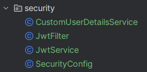


## AuthController. Probando la autenticación


### POST /auth/register**

    - Recibe un usuario y contraseña.
    - Registra un nuevo usuario en la base de datos.
    - Devuelve un mensaje de éxito.

Registrar un nuevo usuario:

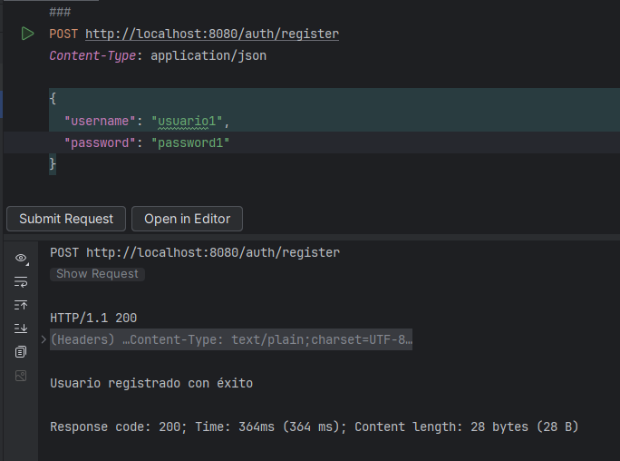

Si el usuario ya existe:

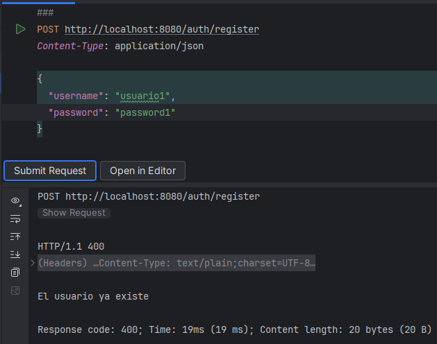

___

### POST /auth/login**

    - Recibe un usuario y contraseña.
    - Autentica al usuario.
    - Genera un JWT y lo devuelve en la respuesta.

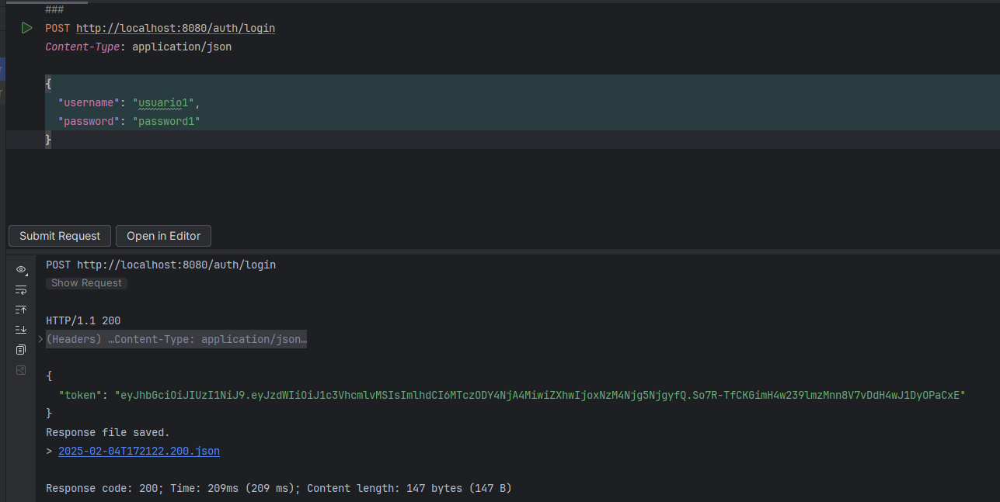


**Problemas de dependencias**

Un error algo así:
java.lang.IllegalStateException: JJWT implementation not found! Ensure jjwt-impl is in the classpath.


Añadir esta configuración de pluggiin en pom.xml:

```
    <build>
        <plugins>
            <!-- Plugin de Spring Boot para empaquetar correctamente -->
            <plugin>
                <groupId>org.springframework.boot</groupId>
                <artifactId>spring-boot-maven-plugin</artifactId>
                <configuration>
                    <mainClass>es.daw.springsecurity.SpringSecurityApplication</mainClass>
                    <layers>
                        <enabled>true</enabled>
                    </layers>
                </configuration>
            </plugin>

            <!-- Plugin para copiar las dependencias a target/lib/ -->
            <plugin>
                <groupId>org.apache.maven.plugins</groupId>
                <artifactId>maven-dependency-plugin</artifactId>
                <executions>
                    <execution>
                        <id>copy-dependencies</id>
                        <phase>package</phase>
                        <goals>
                            <goal>copy-dependencies</goal>
                        </goals>
                        <configuration>
                            <outputDirectory>${project.build.directory}/lib</outputDirectory>
                            <includeScope>runtime</includeScope>
                        </configuration>
                    </execution>
                </executions>
            </plugin>
        </plugins>
    </build>

```

**Comandos a ejecutar:**

jar tf target/*.jar | findstr jjwt  

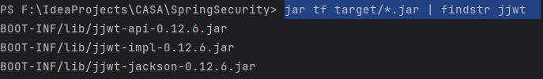

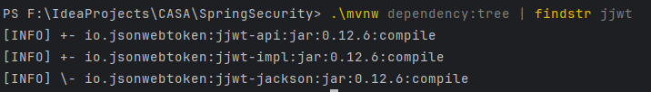

Ejecuta:

```
./mvnw clean package
```

**TENEMOS QUE EJECUTAR POR consola**

java -jar target/myapp.jar

**Error porque la clave secreta para firmar tokens es demasiado débil**

```
2025-02-04 17:03:51 - Secured POST /auth/login
2025-02-04 17:03:51 - POST "/auth/login", parameters={}, headers={masked} in DispatcherServlet 'dispatcherServlet'
2025-02-04 17:03:51 - Mapped to es.daw.springsecurity.controller.AuthController#login(AuthRequest)
2025-02-04 17:03:51 - Read "application/json;charset=UTF-8" to [AuthRequest(username=usuario1, password=password1)]
2025-02-04 17:03:51 - Arguments: [AuthRequest(username=usuario1, password=password1)]
2025-02-04 17:03:52 - Authenticated user
2025-02-04 17:03:52 - Failed to complete request
io.jsonwebtoken.security.WeakKeyException: The specified key byte array is 232 bits which is not secure enough for any JWT HMAC-SHA algorithm.  The JWT JWA Specification (RFC 7518, Section 3.2) states t
hat keys used with HMAC-SHA algorithms MUST have a size >= 256 bits (the key size must be greater than or equal to the hash output size).  Consider using the Jwts.SIG.HS256.key() builder (or HS384.key() or HS512.key()) to create a key guaranteed to be secure enough for your preferred HMAC-SHA algorithm.  See https://tools.ietf.org/html/rfc7518#section-3.2 for more information.

```

**Vamos a generar una clave segura**

Para ello modificamos JwtService


## Probando la autorización

### Crear el controlador con un endpoint protegido

```

@RestController
@RequestMapping("/protegido") // 🔥 Este endpoint estará protegido
public class ProtectedController {

    @GetMapping
    public String accessProtectedResource() {
        // Obtener usuario autenticado
        Authentication authentication = SecurityContextHolder.getContext().getAuthentication();
        String username = authentication.getName();

        return "¡Bienvenido, " + username + "! Has accedido a un recurso protegido.";
    }
}

```

### Asegurar que el endpoint requiere autenticación

Añadido al método **securityFilterChain**:

.requestMatchers("/protegido").authenticated() 


### Acceder a /protegido con el Token

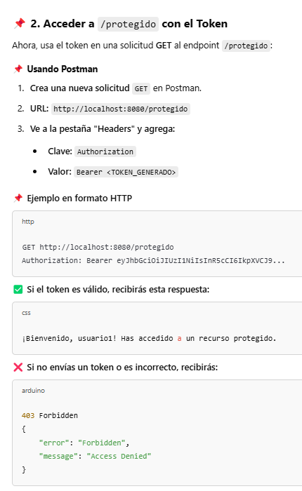