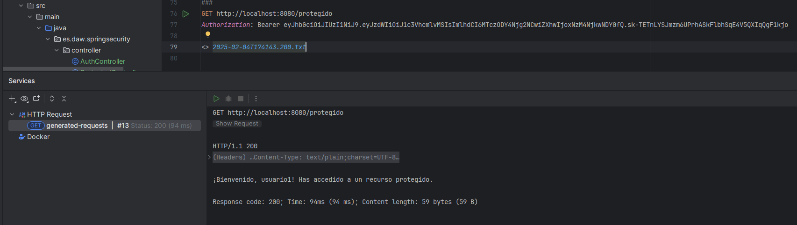
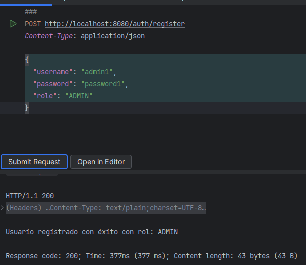
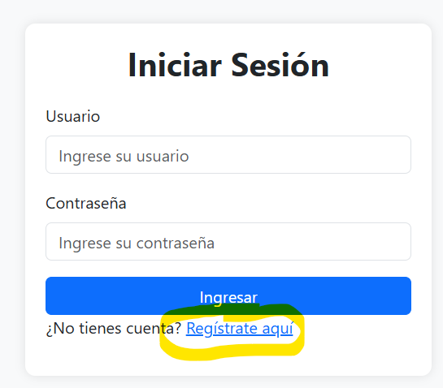
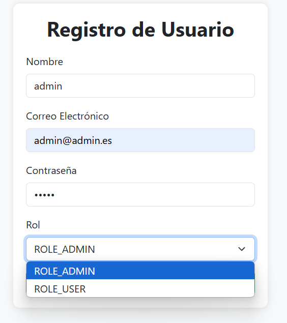
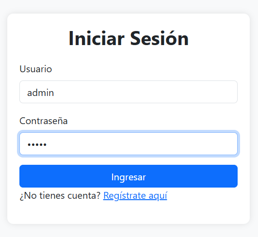
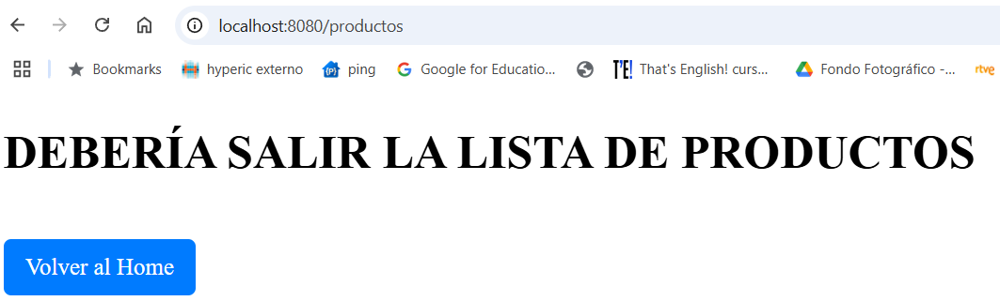
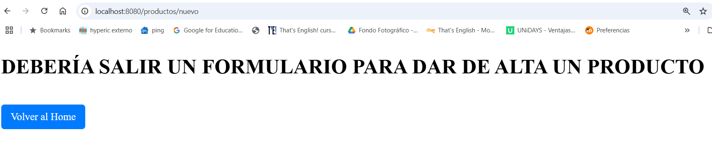
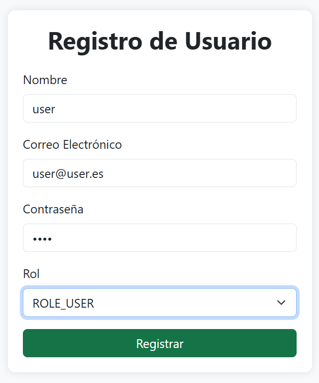
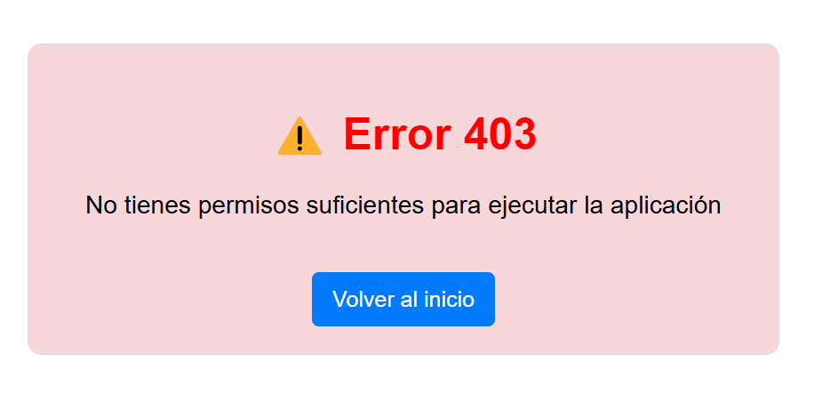

# Conceptos Claves de Seguridad en Aplicaciones Web

## Autenticación vs. Autorización


## JWT (JSON Web Token)


___


*Fuente: Udemy - Construye aplicaciones web Spring Framework 6 y Spring Boot 3*

___

https://jwt.io/


Cuando un usuario haga login (inicie sesión), en vez de trabajar con sesiones, como se hace tradicionalmente, que consume recursos de backend (se genera una cookie, se consume memoria porque ocupa recursos), se genera un token con cierta información (payload).

El token tendrá información no sensible:

- Fecha de generación.
- Fecha de expedición.
- Nombre.
- Email.
- No tendrá la password...

Esta información se firma con un algoritmo, con una clave privada que solo conoce la apliación de Spring Boot.

Cuando a la aplicación le llega el token, la aplicación intenta decodificarlo con esa clave:

- Si se puede decodificar, el token lo ha creado la apliación y se da acceso.
- Si no se puede decodificar, no confiamos en él y no se da acceso.

## Spring Security


__

# EJERCICIO 1: Ejemplo Práctico: Implementación de Spring Security con JWT (Servicio Rest)

## Crea el proyecto y agregar dependencias

El proyecto Spring Boot debe llamarse **SpringSecurity**.

El "Group" y "Package Name" serán **es.daw.springsecurity**

Buscamos *Security* en Starters del pom.xml:


## Configurar H2 en memoria

```
# Configuración de H2 en memoria
spring.datasource.url=jdbc:h2:mem:testdb
spring.datasource.driverClassName=org.h2.Driver
spring.datasource.username=sa
spring.datasource.password=
spring.jpa.database-platform=org.hibernate.dialect.H2Dialect

# Habilitar consola H2 (acceder en: http://localhost:8080/h2-console)
spring.h2.console.enabled=true
spring.h2.console.path=/h2-console

# Hacer que Hibernate recree la base de datos en cada reinicio
spring.jpa.hibernate.ddl-auto=create-drop
```

- Con **create-drop** se crea todas las tablas automáticamente y se eliminan cuando la aplicación se detiene.
- Con **update** se conservan las tablas entre ejecuciones. Si en el futuro quieres que los datos persistan entre reinicios, lo adecuado es cambiar la base de datos a file, no mem y configurar update.

## Cargar datos por defecto

Crear un archivo SQL en **src/main/resources/import.sql**

Spring Boot ejecutará automáticamente los scripts SQL ubicados en src/main/resources cuando se arranque la aplicación. 


**Contenido de import.sql:**

```
-- Crear roles por defecto
INSERT INTO roles (name) VALUES ('USER');
INSERT INTO roles (name) VALUES ('ADMIN');

-- No vamos a crear usuarios. Se crearán a través de un endpoint

```

## Crear Entidades de Usuario y Rol

Entidad Role:

```
@Entity
@Table(name = "roles")
@Data
@NoArgsConstructor
@AllArgsConstructor
public class Role {
    @Id
    @GeneratedValue(strategy = GenerationType.IDENTITY)
    private Long id;

    @Column(unique = true, nullable = false)
    private String name;

    // Relación inversa con 'User'
    @ManyToMany(mappedBy = "roles")  // 'roles' es el nombre del atributo en la entidad User
    private Set<User> users;    
}

```

Entidad User:

```
@Entity
@Table(name = "users")
@Data
@NoArgsConstructor
@AllArgsConstructor
@Builder
public class User implements UserDetails {
    @Id
    @GeneratedValue(strategy = GenerationType.IDENTITY)
    private Long id;

    @Column(unique = true, nullable = false)
    private String username;

    @Column(nullable = false)
    private String password;

    @ManyToMany(fetch = FetchType.EAGER)
    @JoinTable(
        name = "user_roles",
        joinColumns = @JoinColumn(name = "user_id"),
        inverseJoinColumns = @JoinColumn(name = "role_id")
    )
    private Set<Role> roles;

    @Override
    public Collection<? extends GrantedAuthority> getAuthorities() {
        return roles.stream()
                .map(role -> (GrantedAuthority) role::getName)
                .collect(Collectors.toSet());
    }

    @Override
    public boolean isAccountNonExpired() { return true; }

    @Override
    public boolean isAccountNonLocked() { return true; }

    @Override
    public boolean isCredentialsNonExpired() { return true; }

    @Override
    public boolean isEnabled() { return true; }
}

```

Spring Security trabaja con un sistema de autenticación basado en **UserDetailsService**, que carga los usuarios desde la base de datos. Al **implementar UserDetails**, tu entidad User es compatible con Spring Security y puedes personalizar la lógica de autenticación y autorización.

Por otro lado, la anotación **@Builder** permite crear objetos con el patrón Builder:

```
User user = User.builder()
    .username("admin")
    .password("password")
    .roles(Set.of(new Role(1L, "ROLE_USER")))
    .build();

```

Sin usar @Builder:

```
User user = new User();
user.setUsername("admin");
user.setPassword("password");
user.setRoles(Set.of(new Role(1L, "ROLE_USER")));

```

En nuestro caso, Lombok genere automáticamente:

```
public static UserBuilder builder() {
    return new UserBuilder();
}

```

**Cuidado!!!** No es recomendable declarar User como un @Bean en el contexto de Spring. Las entidades (@Entity) deben ser gestionadas por JPA y no por el contenedor de Spring.

## Crear Repositorios

Repositorio de usuarios:

```
public interface UserRepository extends JpaRepository<User, Long> {
    Optional<User> findByUsername(String username);
}

public interface RoleRepository extends JpaRepository<Role, Long> {
    Optional<Role> findByName(String name);
}

```
___
## NUEVO PAQUETE SECURITY


### Dependencias Java JWT


Es necesario añadir manualmente la dependencia a **Java JWT**.

```
        <dependency>
            <groupId>io.jsonwebtoken</groupId>
            <artifactId>jjwt-api</artifactId>
            <version>0.12.6</version>
        </dependency>
        <dependency>
            <groupId>io.jsonwebtoken</groupId>
            <artifactId>jjwt-impl</artifactId>
            <version>0.12.6</version>
            <scope>compile</scope>
        </dependency>
        <dependency>
            <groupId>io.jsonwebtoken</groupId>
            <artifactId>jjwt-jackson</artifactId>
            <version>0.12.6</version>
            <scope>compile</scope>
        </dependency>
```

### Sigue las instrucciones del profesor para montar todas las clases necesarias en el paquete Security


___
## AuthController. Probando la autenticación


### POST /auth/register**

    - Recibe un usuario y contraseña.
    - Registra un nuevo usuario en la base de datos.
    - Devuelve un mensaje de éxito.

Registrar un nuevo usuario:


Si el usuario ya existe:


___

### POST /auth/login**

    - Recibe un usuario y contraseña.
    - Autentica al usuario.
    - Genera un JWT y lo devuelve en la respuesta.


# Posibles problemas de dependencias*

Si os da un error similar a estos: 

- java.lang.IllegalStateException: JJWT implementation not found! Ensure jjwt-impl is in the classpath.
- Class could not be found.  Have you remembered to include the jjwt-impl.jar in your runtime classpath?


Hay que añadir esta configuración de pluggin en pom.xml:

```
    <build>
        <plugins>
            <!-- Plugin de Spring Boot para empaquetar correctamente -->
            <plugin>
                <groupId>org.springframework.boot</groupId>
                <artifactId>spring-boot-maven-plugin</artifactId>
                <configuration>
                    <mainClass>es.daw.springsecurity.SpringSecurityApplication</mainClass>
                    <layers>
                        <enabled>true</enabled>
                    </layers>
                </configuration>
            </plugin>

            <!-- Plugin para copiar las dependencias a target/lib/ -->
            <plugin>
                <groupId>org.apache.maven.plugins</groupId>
                <artifactId>maven-dependency-plugin</artifactId>
                <executions>
                    <execution>
                        <id>copy-dependencies</id>
                        <phase>package</phase>
                        <goals>
                            <goal>copy-dependencies</goal>
                        </goals>
                        <configuration>
                            <outputDirectory>${project.build.directory}/lib</outputDirectory>
                            <includeScope>runtime</includeScope>
                        </configuration>
                    </execution>
                </executions>
            </plugin>
        </plugins>
    </build>

```

**Comandos a ejecutar para realizar comprobaciones:**

jar tf target/*.jar | findstr jjwt  


Ejecuta:

```
./mvnw clean package
```

## Otro posible error: porque la clave secreta para firmar tokens es demasiado débil**

```
2025-02-04 17:03:51 - Secured POST /auth/login
2025-02-04 17:03:51 - POST "/auth/login", parameters={}, headers={masked} in DispatcherServlet 'dispatcherServlet'
2025-02-04 17:03:51 - Mapped to es.daw.springsecurity.controller.AuthController#login(AuthRequest)
2025-02-04 17:03:51 - Read "application/json;charset=UTF-8" to [AuthRequest(username=usuario1, password=password1)]
2025-02-04 17:03:51 - Arguments: [AuthRequest(username=usuario1, password=password1)]
2025-02-04 17:03:52 - Authenticated user
2025-02-04 17:03:52 - Failed to complete request
io.jsonwebtoken.security.WeakKeyException: The specified key byte array is 232 bits which is not secure enough for any JWT HMAC-SHA algorithm.  The JWT JWA Specification (RFC 7518, Section 3.2) states t
hat keys used with HMAC-SHA algorithms MUST have a size >= 256 bits (the key size must be greater than or equal to the hash output size).  Consider using the Jwts.SIG.HS256.key() builder (or HS384.key() or HS512.key()) to create a key guaranteed to be secure enough for your preferred HMAC-SHA algorithm.  See https://tools.ietf.org/html/rfc7518#section-3.2 for more information.

```

**Vamos a generar una clave segura**

Para ello modificamos JwtService:

```
    private final String SECRET_KEY = generateSecureKey().toString();

    private SecretKey generateSecureKey() {
        return Jwts.SIG.HS256.key().build(); // 🔥 Genera una clave segura de 256 bits
    }
```

__
## Probando la autorización

### Crear el controlador con un endpoint protegido

```

@RestController
@RequestMapping("/protegido") 
public class ProtectedController {

    @GetMapping
    public String accessProtectedResource() {

        // Obtener usuario autenticado
        Authentication authentication = SecurityContextHolder.getContext().getAuthentication();
        String username = authentication.getName();

        return "¡Bienvenido, " + username + "! Has accedido a un recurso protegido.";

    }
}

```

### Asegurar que el endpoint requiere autenticación

Añadido al método **securityFilterChain** de **SecurityConfig**:

.requestMatchers("/protegido").authenticated() 


### Acceder a /protegido con el Token



- Authorization → Es la cabecera HTTP estándar para enviar credenciales.
- Bearer → Indica que se está usando un "Bearer Token" (portador del token).
- <TOKEN> → Es el JWT generado durante el login.

___

# Mejorar el sistema para permitir registrar usuarios con diferentes roles (ADMIN, USER, etc.).



El prefijo **ROLE_** es un estándar en Spring Security.

Spring Security, por defecto, espera que los roles de usuario tengan el prefijo ROLE_. 

Algo a tener en cuenta cuando usas anotaciones como @PreAuthorize("hasRole('ADMIN')") o cuando configuras reglas en SecurityConfig con hasRole("ADMIN"). 

Internamente, hasRole("ADMIN") realmente busca "ROLE_ADMIN".

Por ejemplo:

```
@PreAuthorize("hasRole('ADMIN')")
public String adminEndpoint() {
    return "Solo los administradores pueden ver esto";
}

```

Aquí, aunque especificamos "ADMIN", Spring Security busca "ROLE_ADMIN" internamente.

___

# Restringir el acceso a métodos basados en expresión regular

**@PreAuthorize** es una anotación de Spring Security que permite restringir el acceso a métodos basados en expresiones de seguridad.

Ejemplo básico:

```
@PreAuthorize("hasRole('ADMIN')")
public void metodoAdmin() {
    // Solo los usuarios con el rol ADMIN pueden ejecutar este método
}
```

Ejemplo con múltiples roles:

```
@PreAuthorize("hasAnyRole('ADMIN', 'USER')")
public List<Product> list() {
    return service.findAll();
}
```

## Agregar @EnableMethodSecurity en SecurityConfig

```
@Configuration
@EnableWebSecurity
@RequiredArgsConstructor // Para inyectar las dependencias automáticamente porque crea el constructor de propiedades final
@EnableMethodSecurity // Habilita @PreAuthorize y @PostAuthorize
public class SecurityConfig {
    ...
}
```

## Crear el Entity Product

## Crear el ProductRepository

## Crear el ProductService

## Crear el ProductController con Seguridad por Roles

## Asegurar que el JWTService incluye los Roles

## Probar los endpoints con diferentes roles

___

# EJERCICIO 2: Integrar Spring Security en una aplicación monolítica con Spring MVC y Thymeleaf

## Conceptos teóricos

En una aplicación Spring MVC típica, **en lugar de usar directamente un index.html en src/main/resources/static**, se suelen definir **vistas en src/main/resources/templates** usando tecnologías como Thymeleaf y se configuran en un @Controller o en un @Configuration con WebMvcConfigurer.

La función principal de MvcConfig es registrar controladores de vista sin lógica de negocio a través del método addViewControllers. 

Así evitamos mapear una URL a una vista sin la necesidad de un controlador dedicado.

Un **ejemplo de WebMvcConfigurer** sería este:

```
@Configuration
public class MvcConfig implements WebMvcConfigurer {

    @Override
    public void addViewControllers(ViewControllerRegistry registry) {
        registry.addViewController("/").setViewName("home");
        registry.addViewController("/home").setViewName("home");
        registry.addViewController("/login").setViewName("login");
    }
}

```
En el ejemplo trabajado en clase NO hemos usado WebMvConfigurer. 

En su lugar hemos creado los endpoints corresopndientes para redirigir:

Por ejemplo:

```
    @GetMapping("/login")
    public String mostrarLogin(){
        return "login";
    }

    @GetMapping("/home")
    public String mostrarHome(Model model) {
        return "home";
    }
```

En la nueva versión del proyecto, trabajaremos con **WebMvcConfigurer**, por simplificar código.

### Spring Security

- Spring Security funciona añadiendo una cadena de filtros a la aplicación. 
- Estos filtros interceptan las solicitudes HTTP y aplican reglas de seguridad basadas en la configuración. 
- El enfoque moderno para definir reglas de seguridad en Spring Security es a través del **SecurityFilterChain bean.**

### Control de acceso basado en roles (RBAC)

- En una configuración típica de Spring Security, a los usuarios se les pueden asignar roles como ROLE_USER ROLE_ADMIN. 
- Los recursos y los puntos finales se pueden proteger especificando qué roles tienen acceso a ellos.


### ¿Cómo funciona?

1. Cuando el usuario envía el formulario de login, Spring Security:
2. Intercepta la solicitud POST /login
3. Busca el usuario en la base de datos a través de CustomUserDetailsService
4. Verifica la contraseña encriptada
5. Asigna los roles y permisos correspondientes
6. Redirige al usuario a /home si la autenticación es correcta, o a /login?error=true si falla

**SecurityConfig:**

```
    @Bean
    public SecurityFilterChain securityFilterChain(HttpSecurity http) throws Exception {
        http
                .authorizeHttpRequests(auth -> auth
                        .requestMatchers("/", "/home", "/register","/h2-console/**").permitAll()
                        .requestMatchers("/productos/nuevo").hasRole("ADMIN")
                        .requestMatchers("/productos").hasAnyRole("USER", "ADMIN")
                                //.requestMatchers("/productos/**").authenticated()
                        .anyRequest().authenticated()
                )
                .formLogin(login -> login
                        .loginPage("/login") //Usa la URL /login como página de autenticación personalizada.
                        //.defaultSuccessUrl("/productos", true) // Redirige a /productos tras iniciar sesión.
                        .defaultSuccessUrl("/home", true) // Si el login es exitoso, va a home
                        .failureUrl("/login?error=true") // Si el login falla, redirige con ?error=true
                        .permitAll()
                )
                .logout(logout -> logout
                        .logoutUrl("/logout") // Define /logout como la URL para cerrar sesión.
                        .logoutSuccessUrl("/home") // Tras cerrar sesión, el usuario vuelve a /home.
                        .permitAll()
                ) //Cross-Site Request Forgery (CSRF) es un tipo de ataque que engaña a un usuario para que realice acciones en una aplicación web sin su consentimiento o conocimiento
                .csrf(csrf -> csrf.disable()) //Desactiva protección CSRF, H2-Console lo requiere.
                .headers(headers -> headers.frameOptions(f -> f.disable()));// frames de h2-console

        return http.build();
    }

```


**AuthController:**
```
    @GetMapping("/login")
    public String mostrarLogin(@RequestParam(value = "error", required = false) String error, Model model) {
        if (error != null) {
            model.addAttribute("error", "Usuario o contraseña incorrectos. Inténtalo de nuevo.");
        }
        return "login";
    }
```

### Para profundizar sobre el tema

https://spring.io/guides/gs/securing-web

https://docs.spring.io/spring-security/reference/index.html


___

## Proyecto MVC_Security

He subido a este repositorio un proyecto prototipo.

En base a su diseño, la respuesta a las diferentes urls es el siguiente:

### http://localhost:8080 -> redirige automáticamente a localhost:8080/home


Si intento ejecutar las funcionalidades de listar y dar de alta un producto, saldrá el formulario de login, ya que no estoy registrado en la aplicación.

### Antes de iniciar sesión, debo registrarme, ya que no existe ningún usuario en la base de datos

Puedo hacerlo desde el login:



Directamente desde la opción de registro del home:


### Registro

La lista de roles, se están cargando directamente de la base de datos.



### Después del registro, automáticamente puedo iniciar sesión



### Si he hecho login correctamente, puedo acceder a las funcionalidades de productos

#### Como admin





#### Como user

Cierro sesión como admin:


Spring se encarga de cerrar la sesión. No tengo que implementar nada para hacerlo.



Si intento dar de alta un producto, no tendré permisos:



En SecurityConfig se puede usar **exceptionHandling().accessDeniedPage("/error")** para redirigir automáticamente los errores 403 a nuestra página personalizada.

